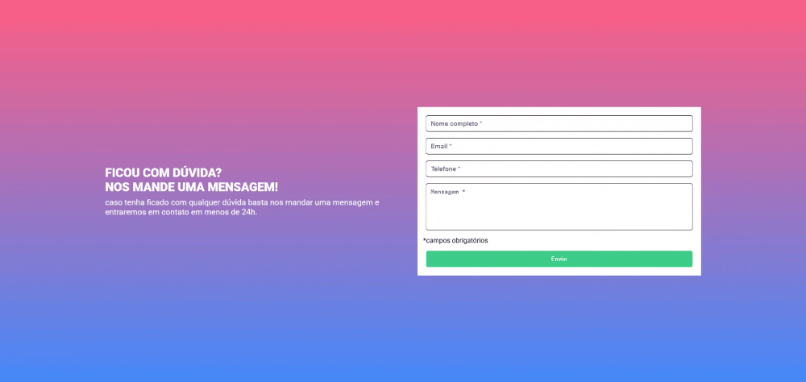

# Formulário com React Hook Form

Este é um formulário feito a partir de um Figma oferecido pelo curso DevQuest que foi dado como um desafio para praticar o HTML, CSS e Javascript, mas que resolvi refazer usando as tecnologias de React, Typescript e o React Hook Form.

### Funcionalidades

- Site responsivo, mostrando o layout mais otimizado de acordo com o tamanho da tela do dispositivo;
- Aceita valores nos campos que quando preenchidos ficam com borda verde, mas quando ficam vazios, ficam com borda vermelha e uma mensagem de campo obrigatório logo abaixo;
- Apresenta botão de envio interativo, mudando de cor ao deixar o cursor em cima ou clicar;
- Os dados dos campos são impressos no `console.log`.

### Captura de tela

## Dificuldades

As maiores dificuldades encontradas ao construir esse projeto foram relacionadas ao uso do React Hook Form e a tipagem com Typescript, por serem habilidades que ainda estou desenvolvendo e ter sido um projeto feito justamente para aprimorá-las.

## Tecnologias usadas

- HTML
- CSS in JS com Styled Components
- Typescript
 - React
 - React Hook Form